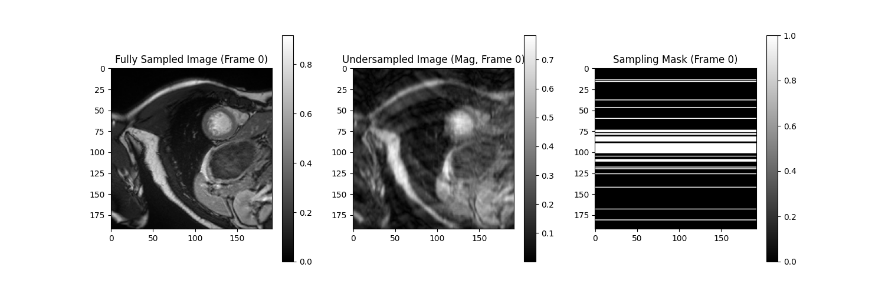
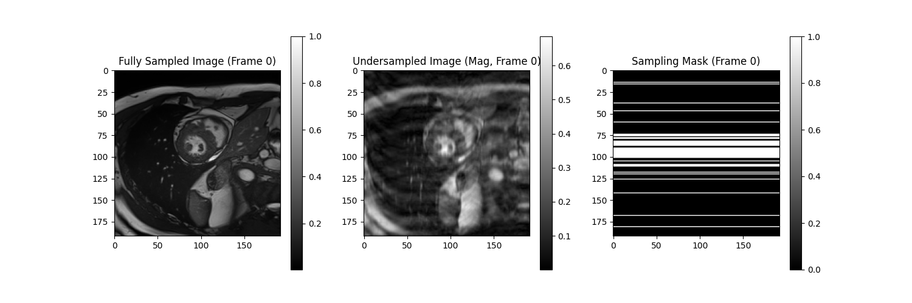

# MRI Reconstruction with Deep Learning

**BME1312 Project 1**

---

## Data Processing

1. **Load Data:** Load the `cine.npz` dataset containing fully sampled MRI frames.
2. **Generate Mask:** Create an undersampling mask.
   * Variable density pattern.
   * Preserves central k-space lines.
   * Random sampling in outer regions.
3. **Apply Mask:** Multiply the k-space representation of the fully sampled data by the mask.
4. **Convert to Image Space:** Apply iFFT to get the undersampled, aliased images.
5. **Format Data:** Convert complex images to pseudo-real format for model input.

---

## Undersampling Mask


---

## Compare the Fully Sampled Images with Aliased Images(1/3)


---

## Compare the Fully Sampled Images with Aliased Images(2/3)



---

## Compare the Fully Sampled Images with Aliased Images(3/3)



---

## Model Architecture 1: UNet

* Encoder-Decoder structure with skip connections.
* Captures multi-scale features.
* **Modifications:**
  * LeakyReLU activation.
  * Dropout for regularization.
  * Batch Normalization.
  * Attention mechanism in the bottleneck.

---

## UNet: Attention Mechanism

* Combines Channel Attention and Spatial Attention.
* **Channel Attention:** Focuses on 'what' features are important. Uses AvgPool and MaxPool along channels.
* **Spatial Attention:** Focuses on 'where' features are important. Uses AvgPool and MaxPool along spatial dimensions.
* Helps the model focus on relevant parts of the input.

```python
    def _attention_block(self, features):
        # ... Channel and Spatial Attention implementation ...
```

---

## Model Architecture 2: 3D ResNet

* Processes the temporal dimension along with spatial dimensions.
* Uses 3D convolutions and residual blocks.
* Designed to capture spatio-temporal correlations.
* `BasicBlock`: Standard residual block with 3x3x3 convolutions.

```python
class ResNet(nn.Module):
    def __init__(self, block, layers, block_inplanes, ...):
        # ... 3D Conv layers, Residual blocks ...
    def forward(self, x):
        # ... Forward pass through ResNet layers ...

def resnet18(**kwargs):
    model = ResNet(BasicBlock, [1, 1, 1, 1], ...) # Example configuration
    return model
```

---

## Combined Model Approach

1. **Input:** Pseudo-real undersampled images (real and imaginary parts as separate channels).
2. **UNet 1 (`model`):** Processes the 'real' part channels.
3. **UNet 2 (`model2`):** Processes the 'imaginary' part channels.
4. **Stack Outputs:** Combine the outputs of the two UNets.
5. **ResNet (`model3`):** Takes the combined UNet outputs (now treated as spatio-temporal data) and performs final reconstruction.

```python
# Forward pass logic in train/evaluate/test
outputs1 = model(x[:, :, 0]) # Process real part
outputs2 = model2(x[:, :, 1]) # Process imaginary part
tmp = torch.stack((outputs1, outputs2), dim=2) # Combine
outputs = model3(lab.pseudo2real(tmp).unsqueeze(2)).squeeze(2) # ResNet processing
```

---

## Training Setup

* **Data Splitting:** Train (114), Validation (29), Test (57) sets.
* **Loss Function:** Mean Squared Error (MSE) or L1 Loss (`criterion`).
* **Optimizer:** Adam optimizer with weight decay.
* **Learning Rate Scheduler:** Warmup phase followed by cosine decay.
  ```python
  lr = lr_scheduler(epoch, warmup_epochs, warmup_lr, initial_lr, num_epochs)
  ```
* **Logging:** TensorBoard for tracking loss curves. Output logs saved to `output/output.txt`.

---

## Results & Conclusion


```txt
Loss: mean = 0.00134656, std = 0.00054760
PSNR: mean = 29.08446121, std = 1.93235576
SSIM: mean = 0.84434632, std = 0.03711063
```

---

## testing images before and after reconstruction

* befroe reconstruction


---

## testing images before and after reconstruction

* after reconstruction


---


## Impact of Dropout and Dynamic Learning Rate

TODO: Compared to the baseline, this improves PSNR and SSIM by ....

---

## Compare L1 with L2

TODO: The L1-trained model ... in  PSNR and SSIM, suggesting ...

---

## Unrolled Deep Learning Reconstruction Network

TODO:
